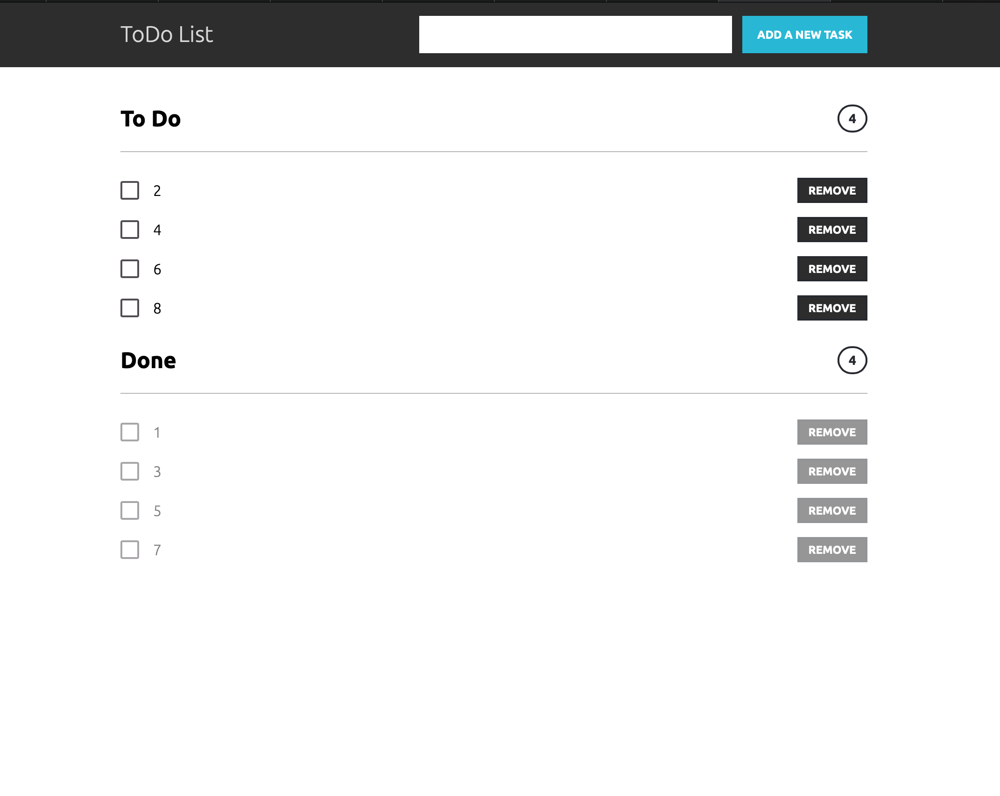

# Just learning Vue.js

## TODO list based on vue.js v3

**Done**:
- used single store for todo and done tasks
- used single method for mark (done, todo) and remove tasks
- used computed for todo and done list size

**TODO**:
- add timestampts
- use templates for tasks
- use local storage to prevent data loose

